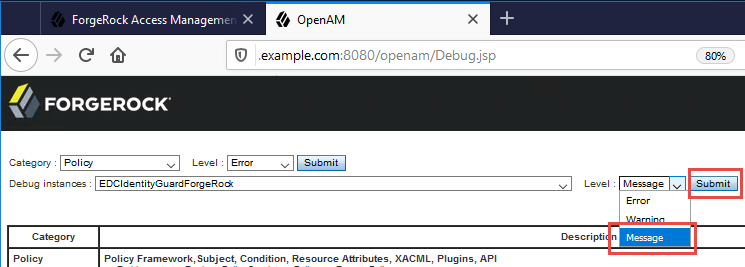

# Entrust IdentityGuard 12.0 and ForgeRock Access Manager 6.5 Technical Integration Guide

## Introduction

This document describes how to configure a second-factor authentication
node for ForgeRock Access Manager (version 6.5 and newer) by integrating
it with Entrust IdentityGuard.

The procedures in this document assume that you have these
prerequisites:

  - a working installation of ForgeRock Access Manager and knowledge of
    how to use it

  - a working installation of Entrust IdentityGuard and knowledge of how
    to use it

## Features

### Multiple second-factor authentication methods 

The ForgeRock Access Manager and Entrust IdentityGuard integration
provides second-factor authentication in addition to the authentication
offered by the open source access management platform, OpenAM. With this
integration, Entrust IdentityGuard can provide the following types of
second-factor authentication:

- **Grid card** - Users respond to a challenge by entering values from
    cells on a grid card in their possession. Use of the grid can be
    further protected with a personal verification number (PVN) or
    temporary one-time password (OTP).

- **One-time password** - A one-time password (OTP) is delivered to a
    user out of band to enter in an OTP challenge. Use of the OTP can be
    further protected with a PVN.

- **Knowledge-based authentication** - Users provide answers to
    questions that they have previously registered with the system.

- **"Classic" hardware or software token** - Users manually enter a
    security code displayed on their hardware token or software token,
    or copy and paste the code from a software token. Use of the token
    can be further protected with a PVN or OTP.

- **Push notification with Entrust IdentityGuard mobile apps (Soft
    Token or Smart Credential)** - To authenticate, users respond to a
    challenge notification sent to their mobile apps by selecting
    a **CONFIRM** button.

### Failover and high-availability

This integration allows you to set up a failover architecture with
multiple Entrust IdentityGuard Servers. Failover works as follows:

1.  Upon startup, the first Entrust IdentityGuard Server in the list,
    (also called the preferred server), is used to process all
    authentication requests.

2.  When a successful connection cannot be made to the current active
    Entrust IdentityGuard server, the ForgeRock solution fails over to
    the next available Entrust IdentityGuard Server, always starting
    with the preferred server, and skipping over any unavailable
    servers.

3.  At defined intervals that you can configure (on the IDG Auth Type
    Selector node), the ForgeRock solution attempts to reconnect to the
    preferred Entrust IdentityGuard Server. The default interval is one
    hour.

## Installation

Installation of the integration consists of deploying a JAR file to
ForgeRock Access Manager 6.5 (or newer) through an Apache Tomcat server

### Download and deploy the JAR file

1.  Download the **EDCIdentityGuardForgeRock-1.0.0.jar** file.

2.  On a computer where the Apache Tomcat web application server is
    installed, copy the JAR file to the following location:

    \<TOMCAT\_HOME\>/webapps/openam/WEB-INF/lib

3.  Restart Apache Tomcat to pick up the new ForgeRock nodes for Entrust
    IdentityGuard.

	After deploying the JAR file, the following Entrust IdentityGuard tree
	nodes are available in the **Components** palette of the ForgeRock
	tree designer, from where they can be added to authentication trees:

	

	The acronym "IDG" stands for "IdentityGuard".

## Configuration

### Configure the Entrust IdentityGuard Server 

Use of this integration requires that you already have a functional
installation of Entrust IdentityGuard Server 12.0. Consult the *Entrust
IdentityGuard Server Administration Guide* and the *Entrust
IdentityGuard Smart Credentials Guide* for information about the
second-factor authentication types that Entrust IdentityGuard can make
available to ForgeRock Access Manager.

### Configure the IDG (IdentityGuard) nodes in ForgeRock Access Manager 

When the JAR file is deployed, 5 new nodes are visible in your ForgeRock
Access Manager Tree designer. Some of the nodes require no
configuration. Others require configuration to achieve specific
behaviors in your integration. Configuration options are described in
the procedure, “Configure the authentication tree”.

### Configure the authentication tree

1. Log in to **ForgeRock Access Manager**.
2. Click **Top Level Realm**.
	
3. To create Entrust IdentityGuard authentication work flows, in the
    navigation pane click **Authentication \> Trees**.
    The **Trees** page appears.

	

4. Click **Create Tree**.

5. Enter a name for the tree.

6. Create the first- and second-factor authentication tree, as follows:

	a. From the **Components** list, drag the following components to the tree in the order they are listed here:

	- Page Node
		
	- Username Collector - Drag this node onto the Page Node.

	- Password Collector - Drag this node onto the Page Node.

	- Data Store Decision

	- IDG Auth Type Selector

	- IDG Collector Decision

	- IDG Input Challenge Collector

	- IDG Push Challenge Collector

	- IDG Auth Decision

	- Success

	- Failure

	b. Wire them together as shown in the following diagram.

	

7. In the tree, click **IDG Auth Type Selector**, and then configure
    the following settings in the **IDG Auth Type Selector** dialog box.

    - **IdentityGuard Server Authentication URL** specify one or more
    IdentityGuard Server Authentication URLs. For example, the first URL
    would be the Primary server, and each other URL would be for a
    replica. Specify multiple URLs to allow failover and
    high-availability.
    
    	Specify each URL in the following format: {http/https}://{hostName/Ip
    	Address}:{port}/IdentityGuardAuthService/services/AuthenticationServiceV11
    
    	Example:
    
    	https://IdentityGuard.example.com:8443/IdentityGuardAuthService/services/AuthenticationServiceV11
    
    - **Number of Retries** If the first attempt to connect to an
    Entrust IdentityGuard server fails, this option specifies how many
    further attempts should be made before marking this server as
    failed.
    
    - **Delay Between Retries** This option specifies how long to wait
    (in milliseconds) between connection attempts. The default is 500
    (0.5 seconds). If the value of the Number of Retries option is 0,
    this option is not used.
    
    - **Failed Server HoldOff Time -** This option defines the minimum
    time (in seconds) that must elapse before attempting to contact a
    server that has been marked as failed. The default is 600 seconds
    (10 minutes).
    
    - **Restore Time To Preferred** When the current active, connected
    server is not the preferred server (that is, the first server in the
    list), this option defines how frequently (in seconds) to try to
    reconnect to the preferred server. The value 0 (zero) means that the
    integration continues to use the current active server, and does not
    attempt to reconnect to the preferred server. The default value is
    3600 seconds (1 hour).
    
    - **Allow User Authenticator Selection** By default, users can
    select a second-factor authenticator to use, if they have more than
    one. Entrust IdentityGuard displays a challenge for the first
    second-factor authenticator listed in the Entrust IdentityGuard
    policy associated with the user. Disable this option if you do not
    want to offer users a choice.
    
    - **Enable Second-factor Bypass** When enabled, this option allows
    ForgeRock users to authenticate even when they have not enrolled for
    Entrust IdentityGuard accounts.

8. In the tree, click **IDG Input Challenge Collector**, and then
    configure the setting in the **IDG Input Challenge Collector**
    dialog box.

	- **Mask Answers** - If this option is enabled, the response 
	entered by the user is masked with characters such as asterisks
	or discs.

9.	In the tree, click **IDG Push Challenge Collector**, and then
    configure the settings in the **IDG Push Challenge Collector**
    dialog box.

	- **Polling Interval** - This option specifies the time interval, in
    seconds, to wait between calls to check for a user response. This
    allows users time to complete a mobile soft token authentication on
    their mobile devices. The default is 2 seconds.

	- **Fallback to Classic** - When this option is enabled, a user can be
    redirected to the “classic” token response page if the time allowed
    for a soft token push authentication elapses without a response.
    This allows users to enter the security code from the token manually
    if they do not have an Internet connection.

10. Click **Save**.

## Test two-step authentication

1.  Open a browser window.

2.  Browse to the ForgeRock Access Manager URL.

	Example:

	[http://forgerock1.example.com:8080/openam/XUI/?\&service=IGDemologin/](http://forgerock1.example.com:8080/openam/XUI/?&service=IGDemo#login/)
	The standard ForgeRock login page appears.

3.  Enter your **User name** and **password**.

4.  Click **Log in**.

	A page appears with an Entrust IdentityGuard second-factor challenge.

	 

	The example above shows a grid as the second-factor challenge. You
	might see a different challenge, depending on the second-factor
	authentication method you have configured or selected.

5.  Enter your response to the second-factor challenge. Example: Consult
    your grid card and enter the values at B4, D1, and F2.

6.  Click **Log in**.

	On successful authentication, the user is redirected to the resource
	page configured with ForgeRock AM.

## Change the logging level

1.  Log in to the ForgeRock administration URL:
    http://\<hostname.domain.com:8080/openam/Debug.jsp

2.  From the **Debug instances** drop-down list,
    select **EDCIdentityGuardForgeRock**.

	

3.  From the **Level** drop-down list to the right, select the logging
    level you want. **Errors** logs only error
    messages, **Warnings** logs errors and warnings,
    and **Messages** logs errors, warnings and informational messages.

4.  Click **Submit**. The screen shows a summary of the change you have
    made.

	

5.  Click **Confirm**.

	
 
	The screen displays a success message.

6.  Repeat steps 2 to 5, this time selecting IDG Auth Node Logs from
    the **Debug instances** drop-down list.

## User experience of second-factor authentication types

The following screen captures show authentication challenges that users
could see when using ForgeRock AM integrated with Entrust IdentityGuard.

### Choose a second-factor authenticator

This is the page on which a user selects the type of second-factor
authenticator to use

### Grid card challenge

### Alternative authenticator

If a user has more than one authenticator but is unable to use the one
requested by the challenge (for example, left the grid card at home),
the user can select **Alternative Authentication** and then select
another type of second-factor challenge.

----------

- **Note:** The **Alternative Authentication** list contains all the
	authenticators supported in your Entrust IdentityGuard installation.
	If users accidentally select alternative second-factor authenticators
	that they do not possess, they will see an error message such as
	“ERROR: Your account has not been activated to use second-factor
	authentication. Please contact your administrator."  

	To avoid this, administrators can disable the Allow User Authenticator
	Selection option on the IDG Auth Type Selector node, or put the
	authentication type that all users have at the top of the list of
	authentication types in the Entrust IdentityGuard policy

----------

### Grid card challenge with personal verification number (PVN) and temporary PIN

### PVN requires an update

### Knowledge-based authentication challenge

### Select a delivery location for a one-time password (OTP)

### Classic token response challenge

### Push authentication challenge for mobile soft token

### Push authentication challenge for mobile smart credential

### Temporary PIN to use token challenge

##How users obtain, activate and manage second-factor authenticators
The organization that provides your second-factor authenticators has a website where you can request second-factor authenticators or, in the case of smart credentials, activate one that has already been created for you.

1. Using a browser, access the Self-Service website. (If you are requesting a mobile soft token or activating a mobile smart credential, use the browser on your mobile device.) Your IT administrator can provide the URL.

2. On the login page, enter your user name and password or one-time password (OTP). Your IT administrator can guide you on which login method to use.

3. If you have not previously registered with Self-Service, a registration page appears. Follow the on-screen prompts to register. Registration might include entering your name and contact information, selecting a mutual authentication image, and registering some question and answer pairs. When your registration is complete, you can log in and go to the Self-Administration Actions page where you can request and manage second-factor authenticators.

    OR

    If you have already registered with Self-Service, you complete an authentication challenge to log in, then you go directly to the Self-Administration Actions page where you can request and manage second-factor authenticators.

    The Self-Administration Actions page lists actions that you can perform, depending on what second-factor authenticators are used in the organization. It could include options like "I'd like to request a soft token" and "I'd like to request a grid card".

    For most actions, the Self-Service page provides all the information you need to accomplish the action.

    For mobile soft tokens and mobile smart credentials, additional detail is available in the app help.

    When you have obtained one or more second-factor authenticators, the Self-Administration Actions page displays options for managing your authenticators, similar to the following example page.
	

    **Examples:**

    "I'd like to unblock my smart credential" - Use this action if you have entered an incorrect smart credential PIN too many times and it has become locked.

    "I've permanently lost my grid or think it's been compromised" - Use this action to get a new grid and deactivate the old one.

4. Follow the on-screen instructions to complete the action you select.